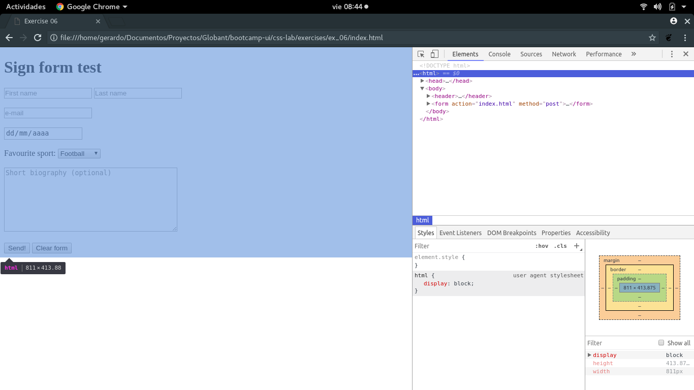
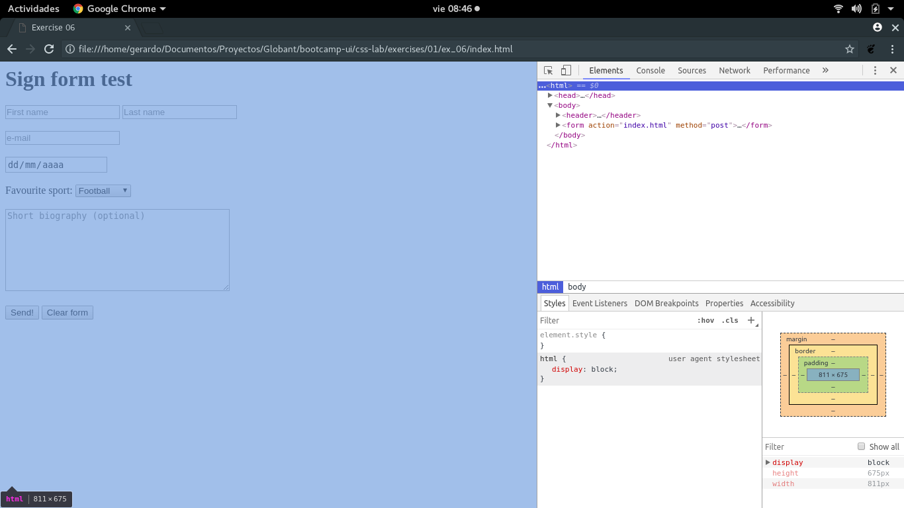

#Notes on exercise 02

###Observed changes when omitting DOCTYPE tag

**Browser:** Google Chrome (developer mode)
**OS:** Ubuntu 17.10

- When omitting DOCTYPE tag if mouse pointer is positioned over html tag all browser 
area is highlighted. On the other hand, when DOCTYPE tag is not ommited highlighting
adjust to the area occupied by the actual document components.

- No other changes observed.

Chrome with DOCTYPE:

Chrome without DOCTYPE:

