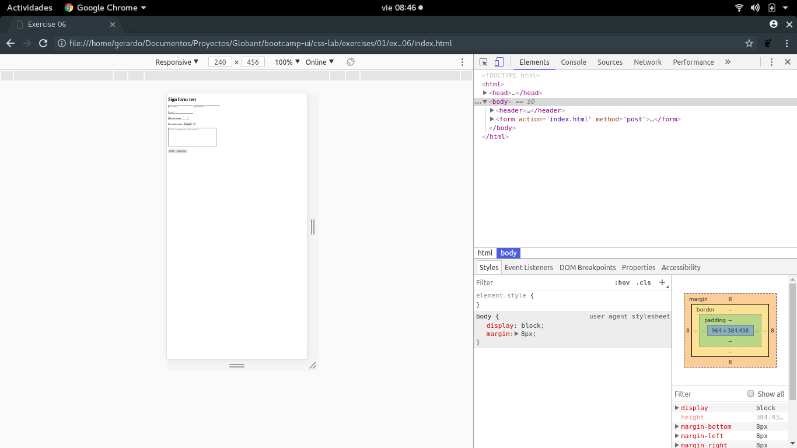
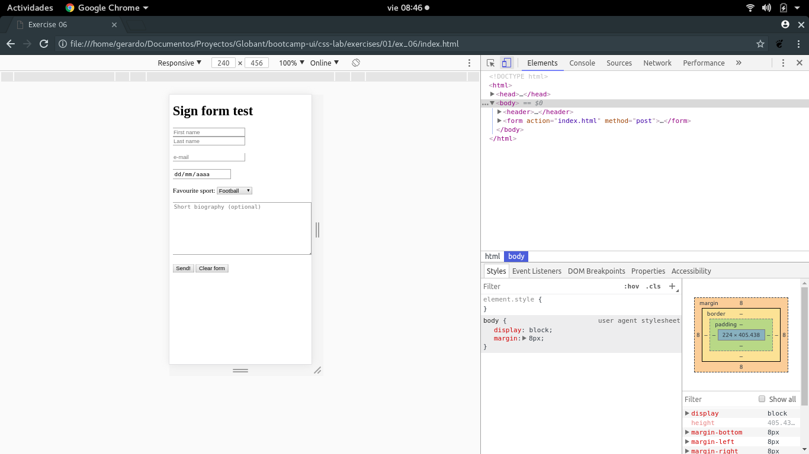
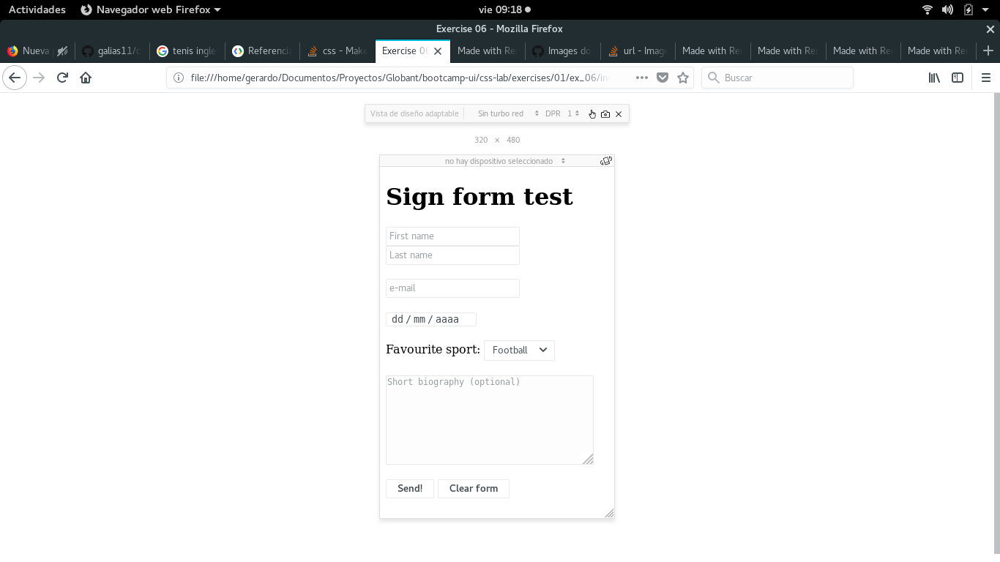

##Notes on exercise 04

###Observed changes when omitting meta viewport tag

**Browser:** Google Chrome (developer mode + mobile)
**OS:** Ubuntu 17.10

- When omitting meta viewport tag and entering on mobile mode, HTML is displayed scaled as if shown on a desktop browser. This means that view becomes very litte and you must
zoom and navigate the page to properly see its components.

Without meta viewport tag:

With meta viewport tag:

**Browser:** Mozilla Firefox (mobile mode)
**OS:** Ubuntu 17.10

- When omitting meta viewport tag and entering on mobile mode, HTML is properly displayed as if the meta viewport tag was included on the HTML document.

Without meta viewport tag:

With meta viewport tag:

